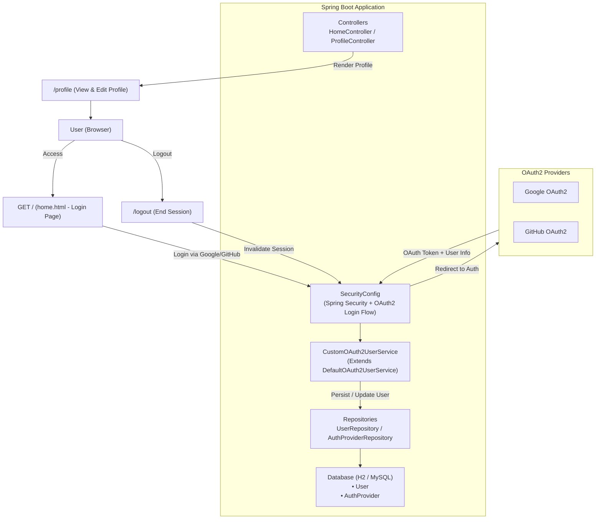

# OAuth2 Integration with GitHub & Google

A Spring Boot application that integrates **OAuth2 login** with Google and GitHub, and provides a minimal **user profile module**. This project demonstrates secure OAuth2 authentication, session-based security, and basic user management.

---

## Features

- OAuth2 login with **Google** and **GitHub**
- First login automatically registers a new user
- Subsequent logins map to the same user
- User profile page:
    - View `displayName`, `bio`, `avatar`, and email
    - Edit `displayName` and `bio`
- Session-based security
- H2 in-memory database (development)
- CSRF protection enabled

---

## Technology Stack

- **Backend:** Spring Boot 3, Spring Security, Spring Data JPA
- **Database:** H2 (dev), MySQL/PostgreSQL compatible
- **Authentication:** OAuth2 Client (`spring-boot-starter-oauth2-client`)
- **Frontend:** Thymeleaf templates
- **Java Version:** JDK 21
- **Build Tool:** Maven

---

## Project Structure
```
oauth2-integration/
├── src/
│   └── main/
│       ├── java/edu/cit/johnjosephlaborada/oauth2integration/
│       │   ├── Oauth2IntegrationApplication.java
│       │   ├── config/
│       │   ├── controller/
│       │   ├── service/
│       │   ├── model/
│       │   └── repository/
│       └── resources/
│           ├── templates/
│           │   ├── home.html
│           │   └── profile.html
│           ├── static/
│           └── application.properties
├── mvnw
├── mvnw.cmd
├── pom.xml
└── README.md
```

## Getting Started
### Prerequisites

- JDK 21 installed
- Maven installed
- IntelliJ IDEA or any IDE with environment variable support
- Google OAuth2 client credentials (Client ID & Secret)
- GitHub OAuth2 client credentials (Client ID & Secret)

---

### Setup

#### Create Google Cloud OAuth2 Credentials

1. Go to [Google Cloud Console](https://console.cloud.google.com/).
2. Log in with your Google account (use your school Gmail if required).
3. At the top, click **“Select a project” → “New Project”**
    - Project name: `oauth2-login`
    - Leave organization blank (if not required).
    - Click **Create**, then **Select Project**.
4. In the left sidebar, go to **APIs & Services → OAuth consent screen**
    - Choose **External**
    - Fill in:
        - App name: `CIT OAuth2 Login`
        - User support email: your Gmail
        - Developer contact email: your Gmail
    - Click **Save and Continue** (you can skip Scopes).
5. Go to **Credentials → Create Credentials → OAuth client ID**
    - Application type: **Web application**
    - Name: `Spring OAuth2 Localhost`
    - Authorized redirect URIs:
      ```
      http://localhost:8080/login/oauth2/code/google
      ```
6. Click **Create** → copy your **Client ID** and **Client Secret**.

---

#### Create GitHub OAuth2 Credentials

1. Go to [GitHub Developer Settings → OAuth Apps](https://github.com/settings/developers).
2. Click **New OAuth App**.
3. Fill in the details:
    - **Application name:** `Spring OAuth2 Integration`
    - **Homepage URL:** `http://localhost:8080`
    - **Authorization callback URL:**
      ```
      http://localhost:8080/login/oauth2/code/github
      ```
4. Click **Register Application** → copy your **Client ID** and **Client Secret**.

---

### Add Environment Variables

Add these to your Run Configuration (IntelliJ): Replace the value with your actual client id and client secret

```bash
GOOGLE_CLIENT_ID=<your_google_client_id>
GOOGLE_CLIENT_SECRET=<your_google_client_secret>
GITHUB_CLIENT_ID=<your_github_client_id>
GITHUB_CLIENT_SECRET=<your_github_client_secret>
```

## Running the Application

### 1. Run the Spring Boot application:
```bash
mvn spring-boot:run
```

### 2. Open your browser and go to:
```bash
http://localhost:8080/
```

### 3. To access the H2 database console:
```bash
http://localhost:8080/h2-console
```

### H2 Settings:
```bash
spring.h2.console.path=/h2-console
spring.datasource.url=jdbc:h2:mem:testdb
spring.datasource.driver-class-name=org.h2.Driver
spring.datasource.username=sa
spring.datasource.password=
```

## API Endpoints
| Method | Endpoint   | Description                           |
|---------|-------------|---------------------------------------|
| GET     | `/`         | Home page with Login options          |
| GET     | `/profile`  | View logged-in user profile           |
| POST    | `/profile`  | Update display name or bio            |
| GET     | `/logout`   | Logout and redirect to home           |

---

## 🧩 Architecture Diagram



## Author

**John Joseph Laborada**  
BSIT - CIT-U  
Submitted on: October 13, 2025

